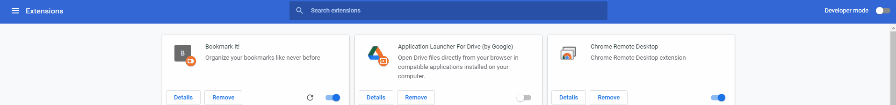
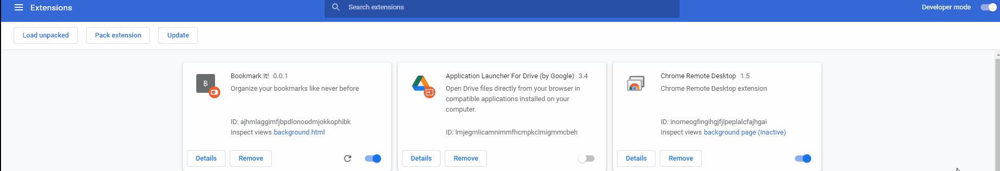
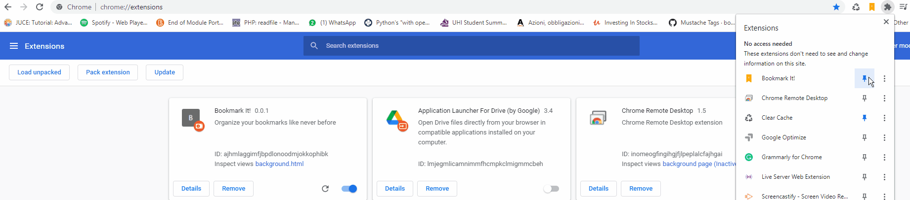
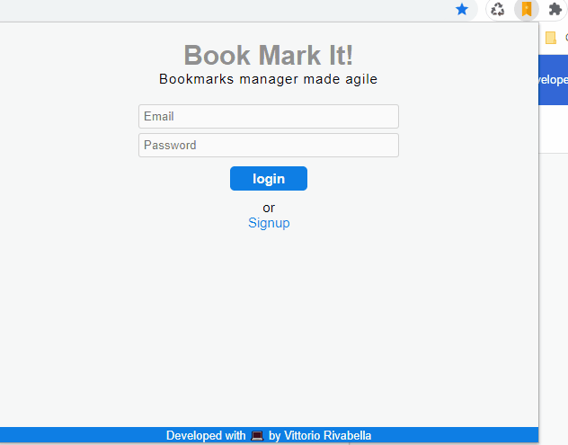
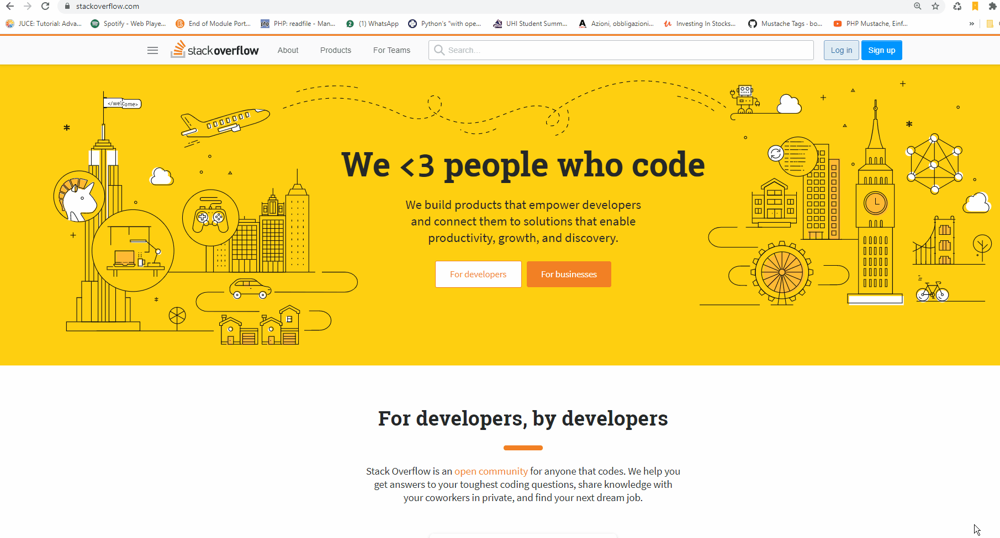
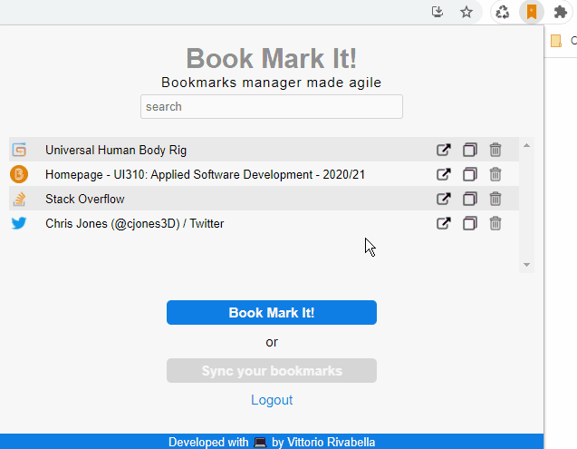

<!--
*** Thanks for checking out the Best-README-Template. If you have a suggestion
*** that would make this better, please fork the repo and create a pull request
*** or simply open an issue with the tag "enhancement".
*** Thanks again! Now go create something AMAZING! :D
***
***
***
*** To avoid retyping too much info. Do a search and replace for the following:
*** github_username, repo_name, twitter_handle, email, project_title, project_description
-->


<!-- PROJECT SHIELDS -->
<!--
*** I'm using markdown "reference style" links for readability.
*** Reference links are enclosed in brackets [ ] instead of parentheses ( ).
*** See the bottom of this document for the declaration of the reference variables
*** for contributors-url, forks-url, etc. This is an optional, concise syntax you may use.
*** https://www.markdownguide.org/basic-syntax/#reference-style-links
-->

[![Stargazers][stars-shield]][stars-url]
[![Issues][issues-shield]][issues-url]
[![MIT License][license-shield]][license-url]
[![LinkedIn][linkedin-shield]](https://www.linkedin.com/in/vittorio-rivabella/)


<br />
<p align="center">
  <a href="https://github.com/Eversmile12/BookmarkIt">
    
  </a>

  <h3 align="center">Bookmark It!</h3>

  <p align="center">
    Bookmarks manager mande agile
    <br />
    <a href="https://github.com/Eversmile12/BookmarkIt"><strong>Explore the docs »</strong></a>
    <br />
    <br />
    <a href="https://github.com/Eversmile12/BookmarkIt/issues">Report Bug</a>
    ·
    <a href="https://github.com/Eversmile12/BookmarkIt/issues">Request Feature</a>
  </p>
</p>


<!-- TABLE OF CONTENTS -->
<details open="open">
  <summary><h2 style="display: inline-block">Table of Contents</h2></summary>
  <ol>
    <li>
      <a href="#about-the-project">About The Project</a>
      <ul>
        <li><a href="#built-with">Built With</a></li>
      </ul>
    </li>
    <li>
      <a href="#getting-started">Getting Started</a>
      <ul>
        <li><a href="#prerequisites">Prerequisites</a></li>
        <li><a href="#installation">Installation</a></li>
      </ul>
    </li>
    <li><a href="#usage">Usage</a></li>
    <li><a href="#roadmap">Roadmap</a></li>
    <li><a href="#contributing">Contributing</a></li>
    <li><a href="#license">License</a></li>
    <li><a href="#contact">Contact</a></li>
  </ol>
</details>


<!-- ABOUT THE PROJECT -->
## About The Project

**Bookmark It!** Is a lightweight bookmark manager that allows you to Save, Manage and Retrieve your precious bookmarks.

The project is currently under development. Please refer to the <a href="#contact">Contact</a> section to report encountered bugs and issues.


### Built With

* Javascript
* [Mustache](https://mustache.github.io/)
* [Firebase](https://firebase.google.com/)
* [Chrome API](https://developer.chrome.com/docs/extensions/reference/)


<!-- GETTING STARTED -->
## Getting Started

To get a local copy up and running follow these simple steps.

### Prerequisites

* Chrome installed

### Installation

1. **Clone the repo:**
   ```sh
   git clone https://github.com/Eversmile12/BookmarkIt.git
   ```
2. **Open up Chrome and browse to the extensions page:**
   ```sh
   Chrome://extensions
   ```
3. **Activate the Extensions developer mode:**

   

4. **Click on Load Unpacked:**

   

5. **Select and load the repository folder:**
   
6. **Pin BookmarkIt! to your extensions toolbox:**

   


<!-- USAGE EXAMPLES -->
## Usage

* Signup with a new account
  
    

* Start bookmarking your favourite pages
  
    

* Search for your bookmarks
  
    


<!-- ROADMAP -->
## Roadmap

See the [open issues](https://github.com/Eversmile12/BookmarkIt/issues) for a list of proposed features (and known issues).


<!-- CONTRIBUTING -->
## Contributing

Contributions are not publicly allowed at the moment.

If you want to contribute to this project, feel free to contact me at: <a href="mailto:vittorio@binaryroot.xyz">vittorio@binaryroot.xyz</a>


<!-- LICENSE -->
## License

Distributed under the GNU  License. See `LICENSE` for more information.


<!-- CONTACT -->
## Contact

Vittorio Rivabella - [@twitter_handle](https://twitter.com/VittoRivabella) - vittorio@binaryroot.xyz

Project Link: [https://github.com/github_username/repo_name](https://github.com/github_username/repo_name)


